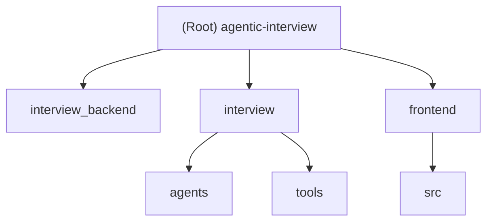

# CLAUDE.md

## Changelog

| 日期 | 变更 |
|------|------|
| 2026-04-24T15:33:52.266Z | 补充扫描：views.py、users.py、llm.py、rubrics.py、coordinator.py、各 agent、auth store、前端视图组件 |
| 2026-04-24T15:26:51.503Z | 初始化 AI 上下文文档，添加 Mermaid 结构图、模块索引、面包屑导航 |

---

## 项目愿景

AI 驱动的自动化面试平台。候选人通过 WebSocket 实时对话完成面试，后端多智能体流水线负责简历解析、安全检测、评分、出题和总结报告，全程无需人工干预。

---

## 架构概览

### 双通道 API

| 通道 | 入口 | 协调器 | 出题/评分 LLM | 安全/总结 LLM |
|------|------|--------|--------------|--------------|
| WebSocket（主） | `consumers.py` | 每连接独立实例 | `chatgpt_model` (gpt-5-mini) | `gemini_model` |
| HTTP（兼容） | `views.py` | 全局单例 `_global_coordinator` | `kimi_model` | `gemini_model` |

WebSocket 端点：`ws://<host>:8000/ws/interview/<chat_id>/`

### 多智能体流水线

```
面试开始
  → ResumeParser        (LLM 解析简历 → structured_profile，缓存至 session)

用户回答
  → SecurityAgent       (正则快检 + LLM 深度分析 → continue/warning/block)
  → ScoringAgent        (5 维度评分，就绪检查)
  → Memory 更新         (记录 Q&A、分数、上下文)
  → QuestionGeneratorAgent  (下一题，锚定简历，可调用 RAG 工具)
  → [第 5-6 轮后] SummaryAgent  (最终报告 + 录用建议)
```

面试生命周期：5-6 轮。第 4 轮后可提前结束，第 6 轮强制结束。安全违规走独立终止路径。

### 数据层

双数据库策略：
- **SQLite**（Django ORM）：认证、会话、管理后台
- **MongoDB**：所有业务数据，通过 `RetrievalSystem`（`interview/tools/rag_tools.py`）访问

MongoDB 集合：`users`、`resumes`、`problem`（知识库 + 1024 维向量）、`result`、`interview_memories`

向量搜索使用阿里云 `text-embedding-v4`，RAG 以 LangChain `@tool` 形式暴露给智能体。

---

## 模块结构图



---

## 模块索引

| 模块路径 | 语言 | 职责 |
|---------|------|------|
| `interview_backend/` | Python | Django 项目配置、ASGI 入口、URL 根路由 |
| `interview/` | Python | 核心面试应用：视图、消费者、用户管理 |
| `interview/agents/` | Python | 多智能体系统：协调器、各专项智能体、会话/记忆管理 |
| `interview/tools/` | Python | RAG 向量检索、MongoDB 统一数据访问层 |
| `frontend/` | TypeScript/Vue 3 | 前端 SPA：面试界面、结果展示、简历编辑 |

---

## 运行与开发

### 后端
```bash
uv sync
daphne -b 0.0.0.0 -p 8000 interview_backend.asgi:application
python manage.py runserver
python manage.py makemigrations && python manage.py migrate
python init.py
```

### 前端
```bash
cd frontend
npm install
npm run dev
npm run build
npm run type-check
npm run test:unit
```

### 必需服务
- **Redis**（端口 6379）：Django Channels WebSocket 层
- **MongoDB**：业务数据 + 向量搜索

### 环境变量（项目根 `.env`）
```bash
MONGODB_URI=...
MONGODB_DB=...
GPT_API_KEY=...
GPT_BASE_URL=...
ALIYUN_API_KEY=...
ALIYUN_BASE_URL=...
DOUBAO_API_KEY=...
DOUBAO_BASE_URL=...
```

---

## 测试策略

- 后端：`interview/tests.py` 存在但为空，**无测试覆盖**
- 前端：Vitest 已配置，**无测试文件**
- 当前无 CI/CD 流水线

---

## 编码规范

- Python/TypeScript 均**未配置** linter 或 formatter
- 所有 MongoDB 操作必须通过 `RetrievalSystem` 进行，不得绕过
- 协调器负责所有数据持久化，各智能体不得重复保存
- 所有智能体须实现 `_fix_common_json_issues()` 修复 LLM 输出的 JSON 格式问题
- `QuestionGeneratorAgent.process()` 只接收 `parsed_profile`，不再接收原始 `resume_data`

---

## LLM 模型配置（`interview/llm.py`）

所有模型通过 `langchain_openai.ChatOpenAI` 配置，timeout=30s：

| 变量名 | 模型 | 用途 |
|--------|------|------|
| `chatgpt_model` | gpt-5-mini | WebSocket 通道出题/评分 |
| `qwen_model` | qwen-plus | 备用 |
| `gemini_model` | gemini-2.5-flash | 安全检测/总结 |
| `doubao_model` | doubao-seed-1-6-250615 | 备用（thinking 已禁用） |
| `kimi_model` | kimi-k2-0711-preview | HTTP 通道出题/评分 |

---

## AI 使用指南

- 修改智能体逻辑前，先阅读 `interview/agents/CLAUDE.md` 了解各智能体职责边界
- 新增智能体须继承 `BaseAgent` 并实现 `get_system_prompt()` 和 `process()`
- 前端硬编码了后端地址 `101.76.218.89:8000`，修改时需同步更新 `stores/auth.ts` 及 `FaceToFaceTestView.vue`
- 已存根/禁用功能：人脸验证（自动通过）、TTS 音频（已注释）、讯飞 ASR（已实现未接入）、口语测试页（占位符）

---

## 扫描覆盖率（截至 2026-04-24T15:33:52.266Z）

| 模块 | 已扫描文件 | 覆盖状态 |
|------|-----------|---------|
| `interview/views.py` | 已读 | 完整 |
| `interview/users.py` | 已读 | 完整 |
| `interview/llm.py` | 已读 | 完整 |
| `interview/rubrics.py` | 已读 | 完整 |
| `interview/agents/coordinator.py` | 已读 | 完整 |
| `interview/agents/question_generator.py` | 已读 | 完整 |
| `interview/agents/scoring_agent.py` | 已读 | 完整 |
| `interview/agents/security_agent.py` | 已读 | 完整 |
| `interview/agents/summary_agent.py` | 已读 | 完整 |
| `frontend/src/stores/auth.ts` | 已读 | 完整 |
| `frontend/src/views/FaceToFaceTestView.vue` | 已读（前200行） | 核心逻辑完整 |
| `frontend/src/views/InterviewResultView.vue` | 已读（前80行） | 模板结构完整 |

尚未扫描（建议下次补充）：
- `interview/consumers.py`（WebSocket 消费者完整实现）
- `interview/tools/rag_tools.py`（RetrievalSystem 完整接口）
- `interview/agents/base_agent.py`（BaseAgent 基类）
- `interview/agents/resume_parser.py`（ResumeParser 完整实现）
- `interview/agents/memory.py`（MemoryStore/MemoryRetriever）
- `interview/agents/session.py`（InterviewSession）
- `frontend/src/views/ResumeRewriterView.vue`
- `frontend/src/router/index.ts`
