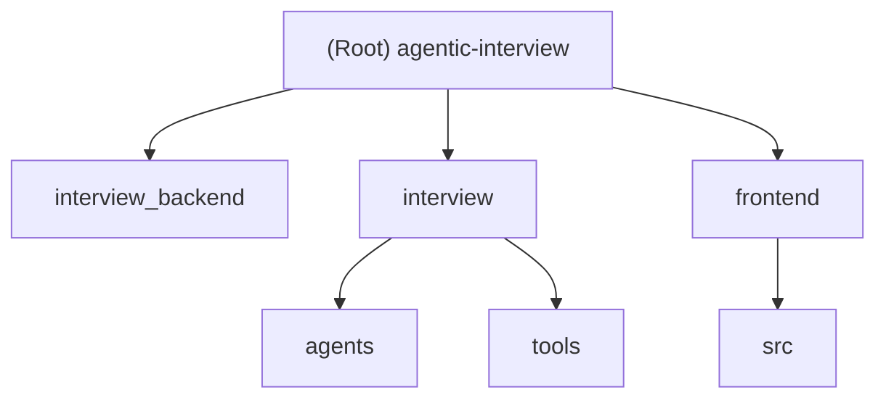

# CLAUDE.md

## Changelog

| 日期 | 变更 |
|------|------|
| 2026-05-07 | **W4 单题整体评分重构（v4，破坏性）**：(1) 删除 5 维度独立打分（`DimensionScore` / `DIMENSION_MAX_SCORE` / `DetailedAnalysis`）；(2) `ScoringOutput` 改为单一 0-10 总分 + `evidence_quote` + `question_focus`；(3) `DecisionEvidence` 字段重写：`dimension/observed_level/rubric_clause` → `question_focus/rationale`；(4) `SummaryOutput.detailed_analysis` 删除，改为 `overall_analysis: str`；(5) 新 prompt `scoring_holistic.yaml` 恢复 v2 软兜底「答对至少 8 分」；(6) ScoringAgent 重写为 N 模型并行 + CISC 加权聚合（5N → N 次 LLM 调用）；(7) agreement 公式改为 `1 - (max - min) / 10`；(8) LangGraph checkpoint 升级 `langgraph_checkpoints_v3` → `v4`；(9) 前端删除雷达图、维度证据卡、`detailed_analysis` 段，新增 Q&A 列表展示（题目 + 考察方向 + 答案 + 单题分数环 + evidence 引用）；(10) `RadarChart.vue` 删除；(11) 测试调整：143 通过（旧 151，5 维度强制覆盖相关用例报废，新增单分制 + ensemble disagreement 用例） |
| 2026-05-04 | **W1-W3 论文驱动重构（v3）+ AES 实验模块**：(1) 集成 5 篇论文（MTS / RULERS / CISC / CoVe / PER + BAS）；(2) Schemas v3 强制内部一致性 + evidence 三元组；(3) ScoringAgent 改 5 维度独立 + 双模型 ensemble (`[doubao, gemini]`) + RAG anchors；(4) SummaryAgent 加 `decision_evidence` / `boundary_case` / `requires_human_review`；(5) graph.py 6 节点 pure-function 拓扑；(6) **新增 QuestionVerifier**（CoVe factor+revise）；(7) PER importance 替换手工 0.5/0.3/0.2；(8) 修复 4 个 P0 内部一致性漏洞（rubric_clause 强制覆盖 / overall_score = mean / decision_evidence turn_index 上界 / answer_snippet fuzzy 校验）；(9) **新增 `interview/aes/` 实验模块**（不影响面试逻辑，EMNLP 2026 双层叙事 ASAP 2.0 instantiation）；(10) **前端 v3 同步**：新增 `types/scoring.ts`，`InterviewResultView` 加决策证据卡 + 复核横幅；(11) 单测 0 → 151；(12) 新增 4 份文档（explainability_paper / emnlp2026_strategy / emnlp2026_paper_skeleton + 本 changelog）|
| 2026-04-30 | 前端 Markdown + KaTeX 集成（marked + DOMPurify + katex）：新增 `utils/markdown.ts` / `MarkdownContent.vue` / `WriteEditor.vue`；FaceToFaceTestView 气泡走 markdown 渲染、输入区改为「写/预览」双 tab；新增 `.env.example` 模板 |
| 2026-04-29 | 修复 P0 安全/契约 bug：SECRET_KEY 改环境变量、ScoringAgent 0 分契约恢复、抽取 `_fix_common_json_issues` 到 BaseAgent、WebSocket 后台任务异常处理与并发锁、前端处理 4 种消息类型 |
| 2026-04-27 | 修复 P0 严重 bug、移除 `interview/views.py`、统一数据结构 / 连接池 / 日志 / JWT、前端 `baseURL` 抽取 |
| 2026-04-24T15:33:52.266Z | 补充扫描：views.py、users.py、llm.py、rubrics.py、coordinator.py、各 agent、auth store、前端视图组件 |
| 2026-04-24T15:26:51.503Z | 初始化 AI 上下文文档，添加 Mermaid 结构图、模块索引、面包屑导航 |

---

## 2026-05-04 论文驱动重构（v3）

> 完整论文化叙述见 [`docs/explainability_paper.md`](./docs/explainability_paper.md)。
> EMNLP 2026 投稿策略见 [`docs/emnlp2026_strategy.md`](./docs/emnlp2026_strategy.md) + [`docs/emnlp2026_paper_skeleton.md`](./docs/emnlp2026_paper_skeleton.md)。

### 集成的 5 篇论文 + 1 个补充

| 论文 | 落地位置 | 关键产物 |
|------|---------|---------|
| [MTS (Lee 2024)](https://arxiv.org/abs/2404.04941) | `scoring_agent.py` + `prompts/scoring_dimension.yaml` | 5 维度独立 prompt，每维度单独 LLM 调用 |
| [RULERS (Hong 2026)](https://arxiv.org/abs/2601.08654) | `schemas.DimensionScore` 强制 evidence_quote + rubric_clause | schema-enforced evidence anchoring |
| [CISC (2025)](https://arxiv.org/abs/2502.06233) | `scoring_agent._aggregate_ensemble` | confidence-weighted 多模型聚合 + agreement |
| [CoVe (Dhuliawala 2024)](https://arxiv.org/abs/2309.11495) | `question_verifier.py` + `next_question_node` | factor+revise 5 个验证轴 |
| [PER (Schaul 2015)](https://arxiv.org/abs/1511.05952) | `memory/store._compute_importance` | rank-based α=0.6 替代 0.5/0.3/0.2 手工权重 |
| [BAS (2026)](https://arxiv.org/html/2604.03216) | `summary_agent._validate_summary_result` | boundary case + requires_human_review 强制规则 |

### 核心 Schema 升级（v3，破坏性，前端已同步）

```python
# interview/agents/schemas.py
class DimensionScore(BaseModel):  # 单维度（MTS + RULERS）
    dimension: Literal[5 个维度]
    level: Literal["LOW", "MEDIUM", "HIGH"]
    score: int                # model_validator 强制 ≤ DIMENSION_MAX_SCORE[dim]
    evidence_quote: str       # 必填，fuzzy match 校验在 answer 中
    rubric_clause: str        # 由 ScoringAgent 强制覆盖为 RUBRIC_DIMENSIONS canonical
    confidence: Literal["high", "medium", "low"]
    model_name: Optional[str]

class ScoringOutput(BaseModel):
    score: int = sum(dim.score for dim in dimensions)  # model_validator 强制
    dimensions: List[DimensionScore]      # min/max 5 项
    agreement: float                      # CISC 多模型一致性
    confidence_level / requires_human_review / fallback_used

class DecisionEvidence(BaseModel):  # RULERS triple
    turn_index, dimension, observed_level, rubric_clause, answer_snippet, impact

class SummaryOutput(BaseModel):
    decision_evidence: List[DecisionEvidence]  # min_length=3
    boundary_case / decision_confidence / requires_human_review / abstain_reason
```

### LangGraph 6 节点拓扑（pure function）

```
START → security → [block?] → finalize_security
                  └→ scoring → persist → readiness → [ready?] → finalize_normal
                                                    └→ retrieval → next_question → END
```

仅 `persist_node` 与 `next_question_node` 允许 mutate `InterviewSession`。LangGraph checkpoint collection 升级到 `langgraph_checkpoints_v3`（旧 collection 自然过期）。

### P0 内部一致性修复（4 项）

1. **P0-1 + P2-2**：`ScoringAgent._score_one` 中 LLM 给的 `rubric_clause` 与 `level` 不一致（或 paraphrase rubric）→ 用 `RUBRIC_DIMENSIONS[dim]["levels"][level]` 强制覆盖
2. **P0-2**：`SummaryAgent._validate_summary_result` 中 LLM 给的 `overall_score` 与 `mean(qa_history.score_details.score)` 偏差 > 0.5 → 强制覆盖为 mean，并在 `abstain_reason` 中标注
3. **P0-3**：`decision_evidence.turn_index` 越界 → 过滤 + `_pad_evidence_with_placeholders` 自动补到 ≥3 条
4. **P0-4**：`decision_evidence.answer_snippet` fuzzy match 不在 `qa_history[turn_index].answer` 中 → 过滤

### 双模型 Ensemble + RAG anchors（W2）

`interview/consumers.py`：

```python
models = {
    "question_model": chatgpt_model,
    "scoring_models": [doubao_model, gemini_model],  # 不同 API 来源
    "security_model": gemini_model,
    "summary_model": gemini_model,
}
```

ScoringAgent `aprocess` 自动调用 `MemoryRetriever.retrieve_similar_cases(k=2, exclude_session_id=...)` 注入 RAG anchors（避免 self-leak）。

### CoVe Verifier（W3.2）

`interview/agents/question_verifier.py`：5 个独立验证轴
- 同步规则：`length` (≤80) / `type_quota` (每类型 ≤2)
- LLM 异步：`resume_anchor` / `no_repeat` / `difficulty_match`
- factor+revise：失败 → 把 violations 注入 QuestionGenerator 二次调用

soft-fail 策略：verifier 异常视为通过（不阻塞主流程，与 Guardrails 的 fail-closed 相反）。

### PER Importance 替换（W3.3）

```python
# interview/agents/memory/store.py::_compute_importance
priority = (|score - baseline| + 0.01) ** 0.6 / NORM_DIVISOR + difficulty_bonus + security_bonus
# baseline = session.get_average_score()（个性化），首轮默认 5.0
```

LangGraph `persist_node` 调用 `save_turn(...)` 时传入 `baseline_score`。

### AES 实验模块（不影响面试逻辑）

新增 `interview/aes/` 模块作为 EMNLP 2026 论文双层叙事的 ASAP 2.0 instantiation：

```
interview/aes/
├── __init__.py / traits.py     ← 5 ASAP traits + LOW/MEDIUM/HIGH rubric
├── schemas.py                  ← TraitScore / EssayScoringOutput（与 DimensionScore 同构但独立）
├── pipeline.py                 ← EssayScoringPipeline (trait × N 模型并行 + CISC + schema enforcement)
├── prompts/aes_trait_scoring.yaml + prompt_loader.py
├── metrics.py                  ← 5 个 explainability metrics
├── data_loader.py              ← ASAP 2.0 CSV 加载 + QWK 计算
├── baselines.py                ← VanillaJudge / GEvalJudge / MTSOnlyJudge
└── run_experiment.py           ← CLI 实验入口
```

**核心设计**：与 `interview/agents/` 共享 `interview.agents.utils.validate_quote_in_answer`，但其余完全独立——AES 不依赖任何面试场景代码，面试 WebSocket 链路 0 改动。

CLI 用法：

```bash
# 跑 50 essays × 4 systems
uv run python -m interview.aes.run_experiment \
    --asap-csv data/asap_2.0/training.tsv \
    --essay-set 8 --limit 50 \
    --systems schemajudge,vanilla,geval,mts_only \
    --output results/asap_set8_n50.json
```

### 测试覆盖

| 文件 | 数量 | 覆盖 |
|------|------|------|
| `test_scoring_mts.py` | 37 | DimensionScore / ScoringOutput 校验 + ensemble 聚合 + fallback |
| `test_summary_evidence.py` | 24 | boundary detect + decision_evidence 必填 + 安全终止 |
| `test_scoring_ensemble.py` | 8 | 双模型 ensemble + RAG anchors 注入 + soft fail |
| `test_question_verifier.py` | 22 | CoVe 同步规则 + LLM 验证 soft-fail |
| `test_per_importance.py` | 7 | PER 公式 + 个性化 baseline + monotonic |
| `test_graph_pure.py` | 6 | 节点 pure function + persist_node 单点 mutate |
| `test_p0_consistency.py` | 20 | rubric_clause 覆盖 + overall_score 一致性 + evidence 校验 |
| `test_aes_module.py` | 33 | AES traits / schemas / pipeline / metrics / baselines / data_loader |
| **合计** | **151** | (旧 0 → 新 151) |

跑全套：`uv run python -m unittest discover interview.tests`

### 前端 v3 同步（破坏性）

| 文件 | 类型 | 内容 |
|------|------|------|
| `frontend/src/types/scoring.ts` | **新增** | `DimensionScore` / `DecisionEvidence` / `ScoringResult` / `SummaryResult` + `extractDimensionsForRadar()`（v2/v3 兼容工具） |
| `frontend/src/views/InterviewResultView.vue` | 重写 | 新增「人工复核横幅」「决策证据卡」「维度证据片段」 |
| `frontend/src/views/FaceToFaceTestView.vue` | 小改 | 进度条加单轮 confidence + agreement + ⚠ 复核标记 + boundary toast |

`npm run type-check` + `npm run build` 0 错误，3.31s 构建通过。

---

## 2026-04-29 安全/契约修复

聚焦 5 个 P0/P1 问题，**不动 WebSocket 鉴权（C1）/ async 化（C3）/ settings 生产化（H1）**，下轮再处理。

### 1. SECRET_KEY 强制环境变量（C2）

`interview_backend/settings.py`：

```python
SECRET_KEY = os.getenv("SECRET_KEY")
if not SECRET_KEY:
    raise RuntimeError("SECRET_KEY 未配置 ...")
```

- 移除硬编码 `'django-insecure-%hjnf1=4j@bs(...)'`，缺失时进程 fail-fast。
- 该密钥被 `interview/auth_utils.py` 用于签发 JWT，硬编码意味着任何人都能伪造任何用户 token。
- 新增 `.env.example` 模板，提示用 `django.core.management.utils.get_random_secret_key()` 生成。
- ⚠️ 当前 `.env` 中仍是占位符 `"django-insecure-xxxx"`，**必须替换为 50+ 字符高熵字符串后才能启动**。

### 2. ScoringAgent 0 分契约恢复（C4）

`interview/agents/scoring_agent.py:135`：

```python
# Before（破坏契约）
result["score"] = max(1, min(10, result["score"]))
# After（保留 0 分语义）
score_val = int(result["score"])
result["score"] = max(0, min(10, score_val))
```

- system prompt 第 39 行明确要求"无有效解答 → 直接给 0 分"，原 `max(1, ...)` 把 0 分硬抬到 1 分，使：
  - `evaluate_interview_readiness` 中 `[s for s in scores if s > 0]` 永远不过滤；
  - 平均分被假性 1 分污染拉高，决策失真。
- 同时增加 `int()` + try/except 保护非数值输入。

### 3. 抽取 `_fix_common_json_issues` 到 BaseAgent（H4）

`interview/agents/base_agent.py` 新增模块级函数 `fix_common_json_issues(response)` 与 `BaseAgent._fix_common_json_issues()` 实例方法。

5 处重复实现（500+ 行）整合为单一来源：

| 文件 | 处理方式 |
|------|---------|
| `question_generator.py` | 删除自有实现，继承 BaseAgent |
| `scoring_agent.py` | 删除自有实现，继承 BaseAgent |
| `security_agent.py` | 删除自有实现，继承 BaseAgent |
| `summary_agent.py` | 删除自有实现，继承 BaseAgent |
| `resume_parser.py` | 非 BaseAgent 子类，保留方法但委托给 `fix_common_json_issues` 模块函数 |

正则 `_TRAILING_COMMA_OBJ` / `_TRAILING_COMMA_ARR` 模块级预编译，避免每次调用重新编译。

### 4. WebSocket 后台任务异常处理与并发锁（C6）

`interview/consumers.py` 关键修复：

- **强引用 + done_callback**：新增 `_pending_tasks: set[asyncio.Task]`，所有后台任务通过 `_spawn_task()` 启动，避免被 GC 中途丢弃；done_callback 统一记录异常并把错误回送前端。
- **断连时取消任务**：`disconnect()` 中遍历 `_pending_tasks` 调用 `task.cancel()`，避免后端继续跑无意义的 LLM 调用。
- **并发锁 `_answer_lock`**：`asyncio.Lock` 串行化 `start_interview` / `process_user_answer`，防止 coordinator 状态机被并发请求踩坑（同步阻塞调用 + 多次 `receive()` 的竞态）。
- `_run_start_interview` 启动失败时回滚 `interview_started` 标志，让用户可以重试。

> 注：本次未做 C3 async 化，同步 `model.invoke()` 仍会阻塞 event loop，但加锁后至少避免了 coordinator 内部状态被并发破坏。

### 5. 前端处理 4 种 WebSocket 消息（C5）

`frontend/src/views/FaceToFaceTestView.vue::onmessage`：

- `JSON.parse` 加 try/catch，避免非 JSON 数据导致整个 handler 抛出。
- 新增 `switch(data.type)` 分支处理：
  - `message`：原正常面试消息流程；
  - `security_termination`：展示违规原因 + `detected_issues`，置 `isCompleted=true`，UI 阻断后续输入；
  - `security_warning`：仅在 `speechErrorText` 显示提示，面试继续；
  - `error`：显示错误信息，`showAnswerButton=true` 允许重试；
  - `raw_message` / 默认：console.warn 兜底。
- 之前所有非 `message` 类型都被静默丢弃，导致候选人触发 prompt injection 后 UI 完全无反应。

### 校验

- `python -m py_compile`：`consumers.py` / 全部 agent / `settings.py` 通过。
- `npm run type-check`：本次新增/修改代码 0 错误（`xfyun-asr.ts` 的 `crypto-js` 缺失为已存在历史问题，与本次无关）。
- 字符串扫描：`django-insecure` 只剩 `settings.py` 错误信息中的引用；`max(1, min(10` 已全部清除。

### 未处理（下轮 P0/P1）

| 编号 | 问题 | 工作量 |
|------|------|--------|
| C1 | WebSocket connect 未校验 JWT，前端可伪造 username 用他人简历开面试 | 2-3h |
| C3 | coordinator 同步 LLM 调用阻塞 WebSocket event loop（单轮最坏 90s+ 卡死全部用户） | 4-7h |
| H1 | settings.py 仍 `DEBUG=True` / `ALLOWED_HOSTS=["*"]` / `CORS_ALLOW_ALL_ORIGINS=True` | 1h |
| H2 | JWT 存 localStorage，存在 XSS 窃取风险 | 2h |
| H5 | `security_agent.py` LLM 解析失败时按"安全/safe"字符串判断 is_safe，可绕过 | 0.5h |

---

## 2026-04-27 重构记要

本次围绕「修复严重 bug + 一致性 / 安全」做了一次集中改造，下面把变更分类列出，便于后续 AI / 人 接手。

### A. P0 严重 bug 修复

| # | 位置 | 症状 | 修复 |
|---|------|------|------|
| 1 | `interview/agents/scoring_agent.py::evaluate_interview_readiness` | `qa.get("score")` 始终拿不到分数（实际嵌在 `score_details.score`），就绪检查恒为缺失 | 引入 `qa_models.get_score()` 统一读分逻辑，过滤掉 `<=0` 的无效分 |
| 2 | `interview/agents/question_generator.py::_count_question_types` | 协调器写入 `question_type`，这里读 `type`，类型分布永远空 | 改用 `qa_models.get_question_type()`，兼容 `question_type` 与遗留 `type` |
| 3 | `interview/agents/summary_agent.py` | `import datetime` 与 `from datetime import datetime` 同时存在，调用 `datetime.datetime.now()` 报 AttributeError；同时存在死代码 `save_comprehensive_interview_result`（违反「协调器统一持久化」约定）和未使用的 `decision` 变量 | 只保留 `from datetime import datetime`；删除 `save_comprehensive_interview_result` 与冗余 MongoDB 初始化；清理未使用变量 |
| 4 | `interview/agents/security_agent.py` | `is_safe = risk_level == "low" and not detected_issues` 过于激进，medium 警告也会终止面试 | 仅当 `suggested_action == "block"`（高风险/prompt-injection）才设为不安全；medium 退化为 warning |
| 5 | `interview/agents/security_agent.py` | `max(..., key=lambda x: {...}[x])` 对未知 LLM 输出会 KeyError | 抽出 `_risk_rank` / `_max_risk` 工具函数，未知值回退 low |
| 6 | `frontend/src/views/FaceToFaceTestView.vue` | 人脸验证完全旁路（`onMounted` 直接置 `isFaceVerified=true`，弹窗永远不出现） | 删除假人脸验证 UI 与状态变量、删除空壳组件 `FaceVerificationDialog.vue`；当前面试不依赖人脸验证 |
| 7 | `interview/views.py` | `index()` view 缩进错误导致 `SyntaxError: invalid syntax`；与 WebSocket 消费者重复一份过时实现 | 整个 `views.py` 删除；`urls.py` 不再注册 HTTP 面试入口（仅保留用户/简历/结果接口） |

### B. 数据结构统一（P1）

新增 `interview/agents/qa_models.py`：

- `QATurn` dataclass：所有 Q&A 轮次的标准结构（`question / answer / question_type / difficulty / question_data / score_details / security_check / timestamp`）。
- `get_score(qa)`：从 `score_details.score` 提取分数，兼容遗留顶层 `score` 字段。
- `get_question_type(qa)`：兼容 `question_type` 与遗留 `type`。

`coordinator.py` 已改用 `QATurn` 构造正常轮次和安全终止轮次，并在重建会话 / 计算分数 / 统计题型时使用 `get_score / get_question_type`，杜绝散落的字段名硬编码。

### C. MongoDB 共享连接池（P1）

新增 `interview/tools/db.py`：

- 模块级单例 `MongoClient`（pymongo 自带连接池）+ 双检锁懒加载。
- `get_mongo_db()` 返回默认数据库句柄。
- `close_mongo_client()` 仅在进程退出时调用。

旧实现里 `users.py` 每个 view、`rag_tools.py` `rag_search`、`init.py` 各函数都会 `MongoClient(...) ... client.close()`，已全部替换为共享连接：

- `interview/users.py`：所有 view 改用 `get_mongo_db()`。
- `interview/tools/rag_tools.py`：`rag_search` 与 `RetrievalSystem` 共享同一 client；`close_connection()` 已删除（连接池由进程统一释放）。
- `init.py`：通过 `get_mongo_db()` 拿连接，`__main__` 退出时调用 `close_mongo_client()`。

### D. JWT 集中化（P1）

新增 `interview/auth_utils.py`：

- `generate_token(user_id, name, hours)` / `decode_token(token)` 收敛 PyJWT 用法。
- `extract_token_from_request(request)` 复用 Authorization Bearer 解析。
- 装饰器 `@jwt_required`：自动校验 token，写入 `request.jwt_payload`，处理 `ExpiredSignatureError` / `InvalidTokenError` / 未知异常并返回 401。

`interview/users.py` 中的 `verify_token / get_user_resume / update_user_resume / get_interview_result` 全部改用装饰器；旧的 `update_interview_result`（仅声明、未注册路由的死代码）一并删除。

### E. 前端 baseURL 抽取（P1）

- 新增 `frontend/src/config.ts`：导出 `API_BASE_URL`（来自 `import.meta.env.VITE_API_BASE_URL`，默认 `http://101.76.218.89:8000`）和 `buildWebSocketUrl(path)` 自动推导 ws/wss。
- 新增 `frontend/.env.example` 和 `frontend/env.d.ts`（`ImportMetaEnv` 类型声明）。
- 替换硬编码：
  - `src/stores/auth.ts` 使用 `API_BASE_URL`。
  - `src/views/FaceToFaceTestView.vue` 使用 `buildWebSocketUrl`。
  - `src/views/ResumeRewriterView.vue` 使用 `${API_BASE_URL}` 拼接。

### F. 统一日志配置（P1）

`interview_backend/settings.py` 增加 `LOGGING` 配置：

- 项目命名空间 `interview` 走 `verbose` formatter，级别由 `INTERVIEW_LOG_LEVEL`（默认 `INFO`）控制。
- 设置 `INTERVIEW_LOG_FILE` 环境变量后追加 `RotatingFileHandler`（10MB × 5）。
- Django / Daphne 日志保持 `WARNING`，避免噪音。
- root logger 不再吞掉异常堆栈。

### G. 删除/清理的死代码

- `interview/views.py`（全文件）
- `interview/agents/summary_agent.py::save_comprehensive_interview_result`、不必要的 MongoDB 初始化
- `interview/agents/question_generator.py::generate_initial_questions`（未被任何调用方使用）
- `interview/users.py::update_interview_result`（未注册路由）
- `interview/tools/rag_tools.py::_get_mongo_client / _get_mongo_collections / RetrievalSystem.close_connection`
- `frontend/src/views/FaceVerificationDialog.vue`（未真正实现的空壳）
- 未使用的 `from dotenv import load_dotenv` / `os` 等冗余 import

### H. 校验

- `python -m py_compile` 全部通过：`coordinator.py`、`scoring_agent.py`、`question_generator.py`、`summary_agent.py`、`security_agent.py`、`qa_models.py`、`users.py`、`auth_utils.py`、`tools/db.py`、`tools/rag_tools.py`、`tools/__init__.py`、`init.py`、`interview_backend/settings.py`、`interview/urls.py`。
- 编辑器静态检查（ReadLints）：上述文件 + 前端 `config.ts`、`stores/auth.ts`、`views/FaceToFaceTestView.vue`、`views/ResumeRewriterView.vue` 全部 0 错误。

---

## 项目愿景

AI 驱动的自动化面试平台。候选人通过 WebSocket 实时对话完成面试，后端多智能体流水线负责简历解析、安全检测、评分、出题和总结报告，全程无需人工干预。

---

## 架构概览

### 单通道 API（WebSocket）

> ⚠️ 旧版的 HTTP 面试通道（`interview/views.py` + `_global_coordinator`）已于 2026-04-27 删除。
> 面试主流程统一走 WebSocket，HTTP 仅保留用户 / 简历 / 结果相关接口。

| 通道 | 入口 | 协调器 | 出题/评分 LLM | 安全/总结 LLM |
|------|------|--------|--------------|--------------|
| WebSocket（主） | `consumers.py` | 每连接独立实例 | `chatgpt_model` (gpt-5-mini) | `gemini_model` |
| HTTP | `users.py` | — | — | — |

WebSocket 端点：`ws://<host>:8000/ws/interview/<chat_id>/`

### 多智能体流水线

```
面试开始
  → ResumeParser        (LLM 解析简历 → structured_profile，缓存至 session)

用户回答
  → SecurityAgent       (正则快检 + LLM 深度分析 → continue/warning/block)
  → ScoringAgent        (单题整体 0-10 评分 + 双模型 CISC ensemble，就绪检查)
  → Memory 更新         (记录 Q&A、分数、上下文)
  → QuestionGeneratorAgent  (下一题，锚定简历，可调用 RAG 工具)
  → [第 5-6 轮后] SummaryAgent  (最终报告 + 录用建议)
```

面试生命周期：5-6 轮。第 4 轮后可提前结束，第 6 轮强制结束。安全违规走独立终止路径。

### 数据层

双数据库策略：
- **SQLite**（Django ORM）：认证、会话、管理后台
- **MongoDB**：所有业务数据，通过 **`interview.tools.db`**（共享 MongoClient 连接池） + `RetrievalSystem`（`interview/tools/rag_tools.py`）访问

> ✅ 2026-04-27 起，所有 MongoDB 访问都必须通过 `interview.tools.db.get_mongo_db()` 拿连接，
> 不允许在 view / agent 内部新建 `MongoClient` 实例。`RetrievalSystem` 内部也已切到共享池。

MongoDB 集合：`users`、`resumes`、`problem`（知识库 + 1024 维向量）、`result`、`interview_memories`、`conversation_memories`（Memento 三元组）

向量搜索使用阿里云 `text-embedding-v4`，RAG 以 LangChain `@tool` 形式暴露给智能体。

---

## 模块结构图



---

## 模块索引

| 模块路径 | 语言 | 职责 |
|---------|------|------|
| `interview_backend/` | Python | Django 项目配置、ASGI 入口、URL 根路由、统一 LOGGING 配置 |
| `interview/` | Python | 核心面试应用：消费者（WebSocket）、用户管理、JWT 装饰器（`auth_utils.py`） |
| `interview/agents/` | Python | 多智能体系统：协调器、各专项智能体、会话/记忆管理、`qa_models.py`（QATurn） |
| `interview/tools/` | Python | RAG 向量检索、MongoDB 共享连接池（`db.py`）、`RetrievalSystem` |
| `frontend/` | TypeScript/Vue 3 | 前端 SPA：面试界面、结果展示、简历编辑、`config.ts`（API_BASE_URL） |

---

## 运行与开发

### 后端
```bash
uv sync
daphne -b 0.0.0.0 -p 8000 interview_backend.asgi:application
python manage.py runserver
python manage.py makemigrations && python manage.py migrate
python init.py
```

### 前端
```bash
cd frontend
npm install
npm run dev
npm run build
npm run type-check
npm run test:unit
```

### 必需服务
- **Redis**（端口 6379）：Django Channels WebSocket 层
- **MongoDB**：业务数据 + 向量搜索

### 环境变量（项目根 `.env`）
```bash
MONGODB_URI=...
MONGODB_DB=...
GPT_API_KEY=...
GPT_BASE_URL=...
ALIYUN_API_KEY=...
ALIYUN_BASE_URL=...
DOUBAO_API_KEY=...
DOUBAO_BASE_URL=...

# 可选：日志（settings.py LOGGING）
INTERVIEW_LOG_LEVEL=INFO          # 项目自身命名空间日志级别（默认 INFO）
INTERVIEW_LOG_FILE=/path/log.log  # 设置后启用 RotatingFileHandler
```

### 前端环境变量（`frontend/.env` / `frontend/.env.local`）
```bash
VITE_API_BASE_URL=http://101.76.218.89:8000
```
未设置时默认值见 `frontend/src/config.ts`。WebSocket 地址由 `buildWebSocketUrl(path)` 自动从 `API_BASE_URL` 推导。

---

## 测试策略

- 后端：`interview/tests.py` 存在但为空，**无测试覆盖**
- 前端：Vitest 已配置，**无测试文件**
- 当前无 CI/CD 流水线

---

## 编码规范

- Python/TypeScript 均**未配置** linter 或 formatter（约定优先于工具）
- **MongoDB 访问统一走 `interview.tools.db.get_mongo_db()`**；高级业务操作（简历 / 结果 / 记忆 / 知识库）走 `RetrievalSystem`，不得在 view / agent 内部重新 `MongoClient(...)`。
- **JWT 校验统一通过 `interview.auth_utils.jwt_required` 装饰器**，view 函数直接读 `request.jwt_payload`，不要重复实现 token 解析。
- **Q&A 历史结构统一为 `QATurn`（`interview/agents/qa_models.py`）**；读分数/题型时使用 `get_score / get_question_type` 助手，避免散落字段名。
- 协调器负责所有数据持久化，各智能体不得重复保存。
- 所有智能体须实现 `_fix_common_json_issues()` 修复 LLM 输出的 JSON 格式问题。
- `QuestionGeneratorAgent.process()` 只接收 `parsed_profile`，不再接收原始 `resume_data`。
- 前端调用后端：HTTP 用 `import { API_BASE_URL } from '@/config'`，WebSocket 用 `buildWebSocketUrl(path)`，不得硬编码 IP/端口。
- 安全策略：仅 `suggested_action == "block"`（高风险/prompt-injection）才中断面试；medium 风险只是 warning，继续面试。

---

## LLM 模型配置（`interview/llm.py`）

所有模型通过 `langchain_openai.ChatOpenAI` 配置，timeout=30s：

| 变量名 | 模型 | 用途 |
|--------|------|------|
| `chatgpt_model` | gpt-5-mini | WebSocket 通道出题/评分 |
| `qwen_model` | qwen-plus | 备用 |
| `gemini_model` | gemini-2.5-flash | 安全检测/总结 |
| `doubao_model` | doubao-seed-1-6-250615 | 备用（thinking 已禁用） |
| `kimi_model` | kimi-k2-0711-preview | HTTP 通道出题/评分 |

---

## AI 使用指南

- 修改智能体逻辑前，先阅读 `interview/agents/CLAUDE.md` 了解各智能体职责边界。
- 新增智能体须继承 `BaseAgent` 并实现 `get_system_prompt()` 和 `process()`。
- **不要新建 MongoClient**：调用 `from interview.tools.db import get_mongo_db`。
- **不要重复实现 JWT 校验**：HTTP view 加上 `@jwt_required` 装饰器即可。
- **前端不要硬编码后端地址**：HTTP 用 `API_BASE_URL`，WebSocket 用 `buildWebSocketUrl(path)`，运行时由 `VITE_API_BASE_URL` 注入。
- 已存根/禁用功能：人脸验证（已删除假实现，前端无人脸校验）、TTS 音频（已注释）、讯飞 ASR（已实现未接入）、口语测试页（占位符）。

---

## 扫描覆盖率（截至 2026-04-27）

| 模块 | 状态 |
|------|------|
| `interview/views.py` | 🗑️ 已删除（HTTP 面试通道下线） |
| `interview/users.py` | ♻️ 已重构（共享连接池 + jwt_required） |
| `interview/auth_utils.py` | ✅ 新增（JWT 集中化） |
| `interview/tools/db.py` | ✅ 新增（MongoClient 共享连接池） |
| `interview/tools/rag_tools.py` | ♻️ 已重构（共享连接池） |
| `interview/agents/qa_models.py` | ✅ 新增（QATurn + 字段助手） |
| `interview/agents/coordinator.py` | ♻️ 已重构（QATurn / get_score / get_question_type / 安全检查策略） |
| `interview/agents/scoring_agent.py` | ♻️ 修复（评分字段路径） |
| `interview/agents/question_generator.py` | ♻️ 修复（题型字段一致性 + 删除死代码） |
| `interview/agents/summary_agent.py` | ♻️ 修复（datetime 冲突 + 删除死代码） |
| `interview/agents/security_agent.py` | ♻️ 修复（KeyError 保护 + 终止策略） |
| `interview_backend/settings.py` | ♻️ 增加 LOGGING 统一配置 |
| `init.py` | ♻️ 切换到共享连接池 |
| `frontend/src/config.ts` | ✅ 新增 |
| `frontend/.env.example` / `frontend/env.d.ts` | ✅ 新增 |
| `frontend/src/stores/auth.ts` | ♻️ 使用 API_BASE_URL |
| `frontend/src/views/FaceToFaceTestView.vue` | ♻️ 对话流 + WriteEditor + MarkdownContent + KaTeX |
| `frontend/src/views/InterviewResultView.vue` | ♻️ 雷达图 + 环形分数 + 减色 + tag 化（2026-04-29） |
| `frontend/src/views/LoginView.vue` | ♻️ 重设计（2026-04-29） |
| `frontend/src/layout/MainLayout.vue` | ♻️ 用户菜单 + 折叠（2026-04-29） |
| `frontend/src/views/ResumeRewriterView.vue` | ♻️ 使用 API_BASE_URL |
| `frontend/src/views/FaceVerificationDialog.vue` | 🗑️ 已删除 |
| `frontend/src/assets/main.css` | ✅ Design Tokens（2026-04-29） |
| `frontend/src/components/RadarChart.vue` | ✅ 新增（SVG 雷达图，2026-04-29） |
| `frontend/src/components/ScoreRing.vue` | ✅ 新增（CSS 环形分数，2026-04-29） |
| `frontend/src/components/MarkdownContent.vue` | ✅ 新增（marked + DOMPurify + KaTeX，2026-04-30） |
| `frontend/src/components/WriteEditor.vue` | ✅ 新增（写/预览双 tab，2026-04-30） |
| `frontend/src/utils/markdown.ts` | ✅ 新增（占位符方案，2026-04-30） |
| `.env.example`（项目根） | ✅ 新增（2026-04-29） |
