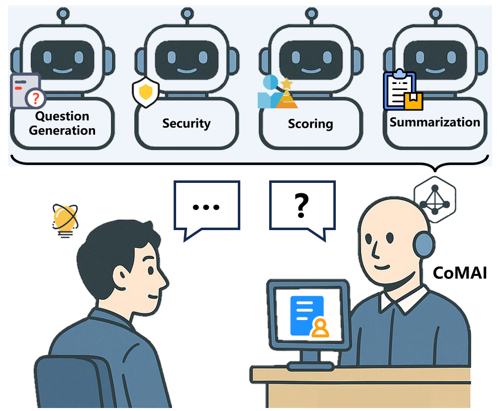
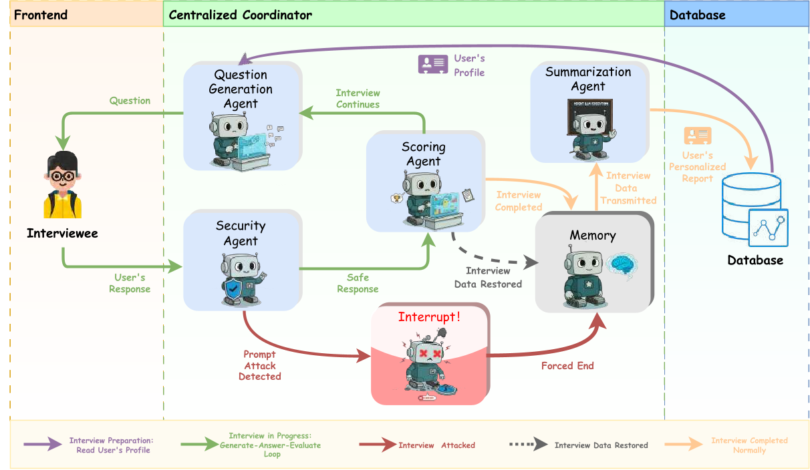

# Agentic AI Interview 

一个多智能体面试平台，在泰山学堂2025年新生中进行测试，具有较高的可扩展性。



## 框架



## 🚀 快速开始

### 环境要求

- Python 3.12+
- Node.js 18+
- Redis Server
- MongoDB

### 1. 克隆项目

```bash
git clone <repository-url>
cd agentic-interview
```

### 2. 后端设置

#### 安装依赖
```bash
# 使用 uv (推荐)
uv sync

#### 配置环境变量
创建 `.env` 文件：
```bash
# AI模型配置
DEEPSEEK_API_KEY=your_deepseek_key
GEMINI_API_KEY=your_gemini_key

# 数据库配置
MONGODB_URI=your_mongodb_connection_string
MONGODB_DB=your_database_name
MONGO_URI=your_mongodb_uri
MONGO_DATABASE_NAME=your_db_name
```

#### 数据库迁移
```bash
uv run python manage.py migrate
```

#### 启动后端服务
```bash
source .venv/bin/activate
daphne -b 0.0.0.0 -p 8000 interview_backend.asgi:application
```

### 3. 前端设置

```bash
cd frontend

# 安装依赖
npm install

# 开发模式
npm run dev

# 构建生产版本
npm run build
```

### 4. 外部服务

#### 启动 Redis
```bash
redis-server
```

#### 启动 MongoDB
```bash
mongod
```

#### 启动 Ollama 嵌入模型
```bash
ollama run Q78KG/gte-Qwen2-7B-instruct:latest
```

## 📁 项目结构

```
agentic-interview/
├── interview_backend/          # Django 项目配置
├── interview/                  # 核心面试应用
│   ├── agents/                # 多智能体系统
│   │   ├── base_agent.py      # 智能体基类
│   │   ├── coordinator.py     # 多智能体协调器
│   │   ├── memory.py          # 记忆管理系统
│   │   ├── retrieval.py       # RAG检索系统
│   │   ├── question_generator.py  # 问题生成智能体
│   │   ├── scoring_agent.py   # 评分智能体
│   │   ├── security_agent.py  # 安全检测智能体
│   │   └── summary_agent.py   # 总结智能体
│   ├── consumers.py           # WebSocket 消费者
│   ├── views.py              # HTTP API 视图
│   ├── models.py             # 数据模型
│   └── users.py              # 用户管理
├── frontend/                  # Vue.js 前端
│   ├── src/
│   │   ├── components/       # Vue 组件
│   │   ├── views/           # 页面视图
│   │   ├── stores/          # Pinia 状态管理
│   │   ├── services/        # API 服务
│   │   └── router/          # 路由配置
│   └── package.json
├── CLAUDE.md                 # 开发指南
└── README.md                 # 项目说明
```


## 🛠️ 开发指南

### 多智能体工作流程

1. **面试启动** → 协调器创建会话，问题生成智能体产生首个问题
2. **用户回答** → 安全智能体检测 → 评分智能体评分 → 记录到记忆系统
3. **生成下一题** → 问题生成智能体基于历史和表现生成新问题
4. **判断完成** → 评分智能体判断是否收集足够信息
5. **生成总结** → 总结智能体分析整个面试过程并给出建议


## 🔒 安全特性

- **提示词注入检测** - 防止恶意指令绕过系统
- **输入验证** - 检测异常输入模式
- **会话隔离** - 每个面试会话独立管理
- **访问控制** - JWT认证和权限管理

## 🚀 部署

### 生产环境部署

1. **环境配置**
```bash
# 生产环境变量
export DJANGO_SETTINGS_MODULE=interview_backend.settings
export DEBUG=False
```

2. **收集静态文件**
```bash
uv run python manage.py collectstatic
```

3. **使用 Daphne 启动项目**
```bash
daphne -b 0.0.0.0 -p 8000 interview_backend.asgi:application
```

### Docker 部署

```dockerfile
FROM python:3.12-slim
WORKDIR /app
COPY . .
RUN pip install uv && uv sync
EXPOSE 8000
CMD ["uv", "run", "python", "manage.py", "runserver", "0.0.0.0:8000"]
```

## 🤝 贡献指南

1. Fork 项目
2. 创建功能分支 (`git checkout -b feature/AmazingFeature`)
3. 提交更改 (`git commit -m 'Add some AmazingFeature'`)
4. 推送到分支 (`git push origin feature/AmazingFeature`)
5. 创建 Pull Request

## 📄 许可证

本项目采用 MIT 许可证 - 查看 [LICENSE](LICENSE) 文件了解详情

## 🙏 致谢

感谢以下开源项目：
- [LangChain](https://github.com/langchain-ai/langchain) - AI应用开发框架
- [Django](https://github.com/django/django) - Web框架
- [Vue.js](https://github.com/vuejs/vue) - 前端框架
- [Element Plus](https://github.com/element-plus/element-plus) - UI组件库

---

⭐ 如果这个项目对您有帮助，请给我们一个星标！